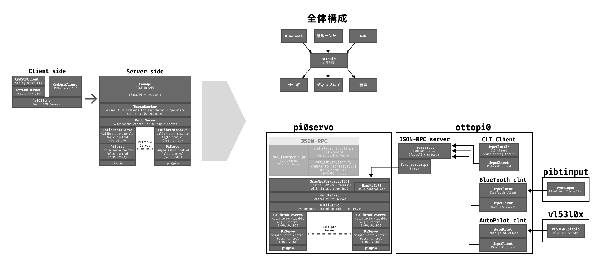
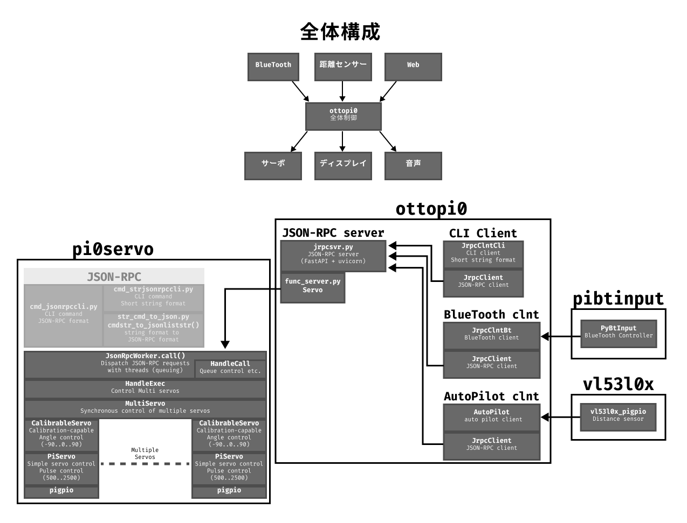
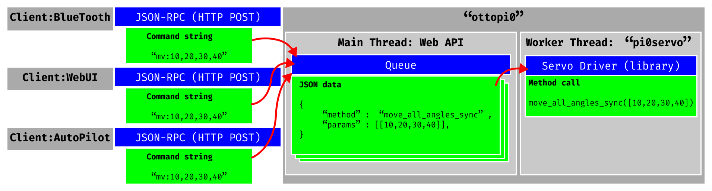

# OttoPi0 - ``Otto DIY`` like biped robot for Raspberry Pi Zero 2W

## == 特徴

- Raspberry Pi Zero 2W

## == Install

## == Software Archives

## == 

## == 参考

### 8BitDo Micro

Keyboard mode

### Links
- [Otto DIY](https://www.ottodiy.com/)
