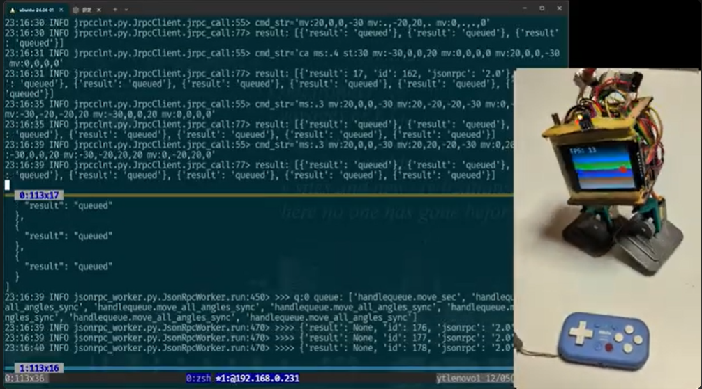

# OttoPi0 - ``Otto DIY`` like biped robot for Raspberry Pi


## == 特徴

### Hardware

- Raspberry Pi Zero 2W
- Original PCB

### Software

- Raspberry Pi OS (bookworm)
- pigpio
- Python


## == Install

### === Raspberry Pi OS (bookworm)

**重要**: 最新版ではなく、「bookwork」にすること！


### === 基本ツールのインストール: mise, uv

**mise**: ツールや言語のバージョン管理 ＋ タスクランナー

**uv**: Pythonプロジェクト管理

``` bash
# mise のインストール
curl https://mise.run | sh

# mise の初期設定
## bashの場合
echo 'eval "$(~/.local/bin/mise activate bash)"' >> ~/.bashrc
## zshの場合
echo 'eval "$(~/.local/bin/mise activate zsh)"' >> ~/.zshrc

# === ここでシェルを再起動 or ターミナル再起動 or sshし直しなど ===

# uv, python のインストール
mise use -g uv@latest
mise use -g python@latest
```


### === ``ottopi0``と関連パッケージのインストールと設定

``` bash
# gitクローン
for p in pi0servo pi0disp pibtinput vl53l0x_pigpio ottopi0; do git clone https://github.com/ytani01/$p; mise trust $p/mise.toml; done

cd ottopi0
cp ottopi0.toml.sample ~
mise run build
```


## == 使用方法

### === 1. ``~/ottopi0.toml``の設定

- ピン番号の設定


### === 2. ロボット制御サーバーの起動

``` bash
uv run ottopi0 svr
```


## == サーボ制御コマンドについて

### === ``mv``コマンドと動作


## == 内部構造

### == Software Archives


### === ``mv``コマンドの内部フロー


## == 動画

### === 2025/12/06 途中経過

[](https://youtu.be/xyQxWBR0ToA?si=hiaeGzaGVpkgNSoV)


## == 参考

### 8BitDo Micro

Keyboard mode


### Links
- [Otto DIY](https://www.ottodiy.com/)
