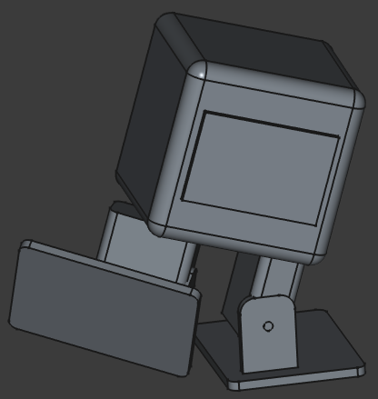
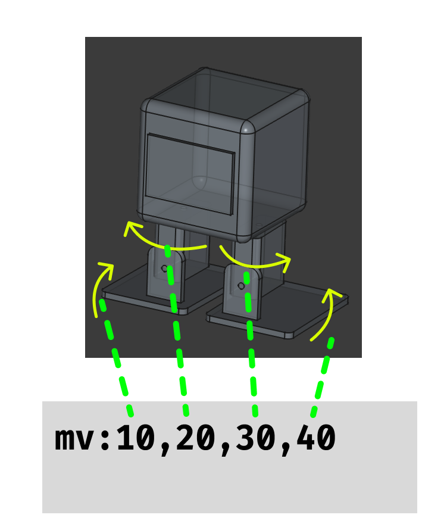

# OttoPi0 - ``Otto DIY`` like biped robot for Raspberry Pi

## == 特徴

### Hardware

- Raspberry Pi Zero 2W
- Original PCB

### Software

- Raspberry Pi OS (bookworm)
- pigpio
- Python

## == Install

## == Software Archives

## == コマンドについて

### === ``mv``コマンドと動作

## == 内部構造

## == 途中経過

### === 2025/12/06

<iframe width="560" height="315" src="https://www.youtube.com/embed/xyQxWBR0ToA?si=kfQSmGZ5lBnNNNnq" title="YouTube video player" frameborder="0" allow="accelerometer; autoplay; clipboard-write; encrypted-media; gyroscope; picture-in-picture; web-share" referrerpolicy="strict-origin-when-cross-origin" allowfullscreen></iframe>

## == 参考

### 8BitDo Micro

Keyboard mode

### Links
- [Otto DIY](https://www.ottodiy.com/)
